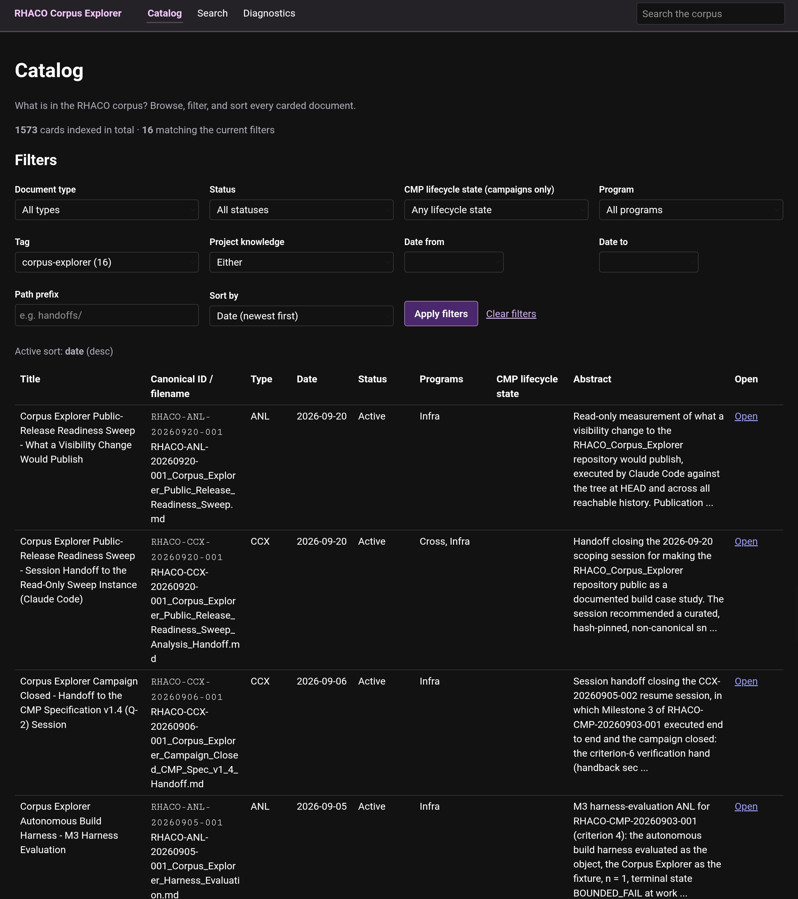
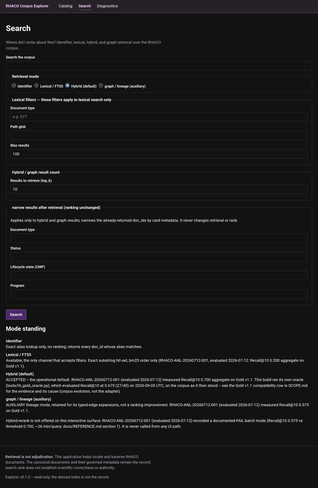
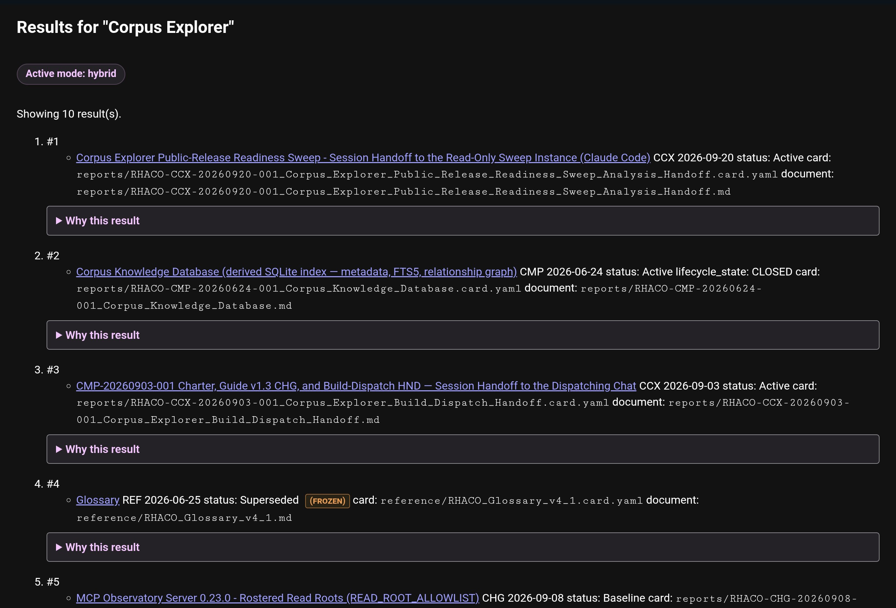
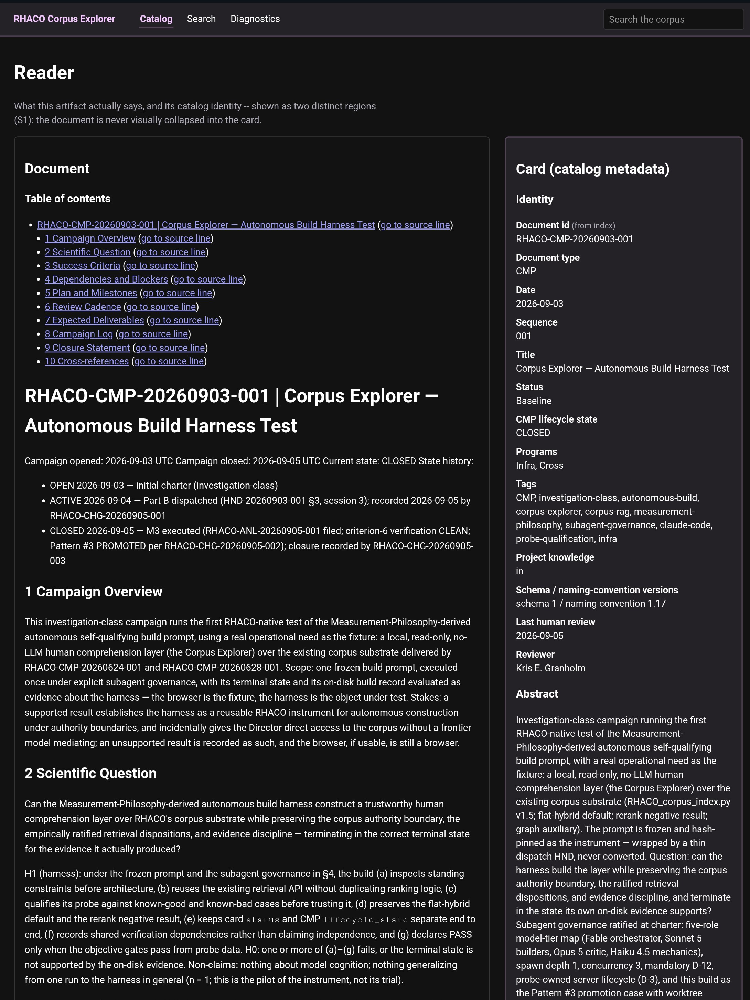

# How the RHACO Corpus Explorer works

**Audience:** readers who want to understand the application, its data boundaries, and its operation without first reading the autonomous build instructions.

This is an account of the repository's recorded architecture and implementation, not a claim that the application was re-executed as part of writing this guide. The original engineering contract is [`../ARCHITECTURE.md`](../ARCHITECTURE.md); observable limitations are recorded in [`../SCOPE.md`](../SCOPE.md).

## 1. The problem: human access to a structured research record

RHACO's corpus contains canonical documents accompanied by structured `.card.yaml` metadata. A card identifies a document and describes properties such as document type, status, tags, program membership, references, and other relationships. Documents can be connected through citations, supersession, amendments, and campaign relationships. These relationships make the library more than a folder of loosely associated files.

RHACO already had a machine-facing corpus-index and retrieval layer. The missing interface was a human-facing way to find and inspect the same records directly, without asking an LLM to summarize or mediate every lookup. The Explorer provides that interface. It is a **comprehension and navigation instrument**, not a new authority, automatic research evaluator, or generative question-answering system.

## 2. The authority boundary

Three distinct layers must not be confused:

1. **Canonical sources:** document bodies and their sibling metadata cards in the RHACO library. These are the record of authority.
2. **Derived index:** `corpus_index.db`, maintained by RHACO's existing corpus infrastructure. It accelerates lookup with card metadata, full-text data, vectors, identifier aliases, and typed edges; it can lag the original library.
3. **Explorer:** a read-only consumer that queries the index, opens originals, and renders the results for a human.

The index is not a second canonical corpus. The Explorer does not repair stale metadata, change the source files, or reindex them. A requested freshness check reports its observations and scope; it does not perform maintenance. A document appearing first in search does not thereby become scientifically true, formally authoritative, or publication-ready.

## 3. Request path and components

```text
Browser request
      |
      v
FastAPI route -> module service -> shared CorpusAdapter
      |                                  |
      |                       +----------+----------+
      |                       |                     |
      |                RHACO corpus API       fixed read-only SQL
      |                       |              for documented facets
      |                       +----------+----------+
      |                                  |
      |                      derived SQLite index
      |                                  |
      |                     card/document lookup
      |                                  |
      |                      canonical source files
      |
      v
One view model -> HTML template or corresponding /api JSON response
```

The local Python web server uses **FastAPI** for routes and **Jinja2** for server-rendered pages. The frontend uses CSS and limited vanilla JavaScript rather than a large client-side framework. Main pages have JSON counterparts assembled from the same view data; the JSON endpoints are for inspecting application output, not general-purpose database or SQL access.

The shared adapter is the controlled read path for the feature modules. It wraps RHACO's existing retrieval APIs, translates results into typed application models, performs approved fixed and parameterized read-only metadata queries, and applies confined file reads when opening original documents. Most feature modules do not independently connect to the database or implement search algorithms. `ARCHITECTURE.md` enumerates the explicitly permitted direct module imports, including exceptional diagnostic and fixture paths; describing the adapter as literally the only importer in the entire workspace would be incorrect.

The repository's components are organized by responsibility:

| Component | Responsibility |
|---|---|
| `explorer/corpus_adapter/` | RHACO integration, approved index queries, availability and file access. |
| `explorer/catalog/` | Structured browsing, facets, sorting, and pagination. |
| `explorer/search/` | Search-mode selection, result presentation, provenance and disclosure. |
| `explorer/reader/` | Canonical documents, metadata cards, headings, and line navigation. |
| `explorer/lineage/` | Typed relationship lists, graph layout, chains and campaign subtrees. |
| `explorer/diagnostics/` | Index metadata, availability and on-demand freshness reporting. |
| `explorer/web/` | Shared page templates, CSS, and lightweight client interactions. |

`explorer/app.py` registers the modules and exposes a health endpoint. Its settings default to loopback `127.0.0.1`, port `8765`, with configurable database and document paths. These are historical configuration facts, not a general deployment recipe.

## 4. The five user surfaces

The screenshots in this section were taken on September 19–20, 2026, against the live RHACO corpus as it then stood, which is later and larger than the corpus the build ran against. They show what the application looks like in use. They are not the build's probe captures and carry no evidential weight about the build.

### Catalog



*Catalog, filtered to one tag and sorted newest first. Document status and CMP lifecycle state are separate columns.*

The catalog provides a structured entry point. Its metadata filters include type, editorial document status, CMP investigation lifecycle state, dates, programs, tags, and other available card fields. **Status and lifecycle state are distinct:** a document's library state is not the same thing as its parent investigation's stage. The browser and queries maintain that distinction rather than collapsing them into one status label.

### Search



*The search form. Filters that apply only to lexical search are grouped apart from post-retrieval narrowing, and the mode-standing panel quotes each mode's dated evaluation rather than a bare claim.*



*Hybrid results. Each row names its card and document paths, and "Why this result" opens that row's provenance disclosure.*

Search exposes four modes from the existing RHACO retrieval system:

| Mode | What it does | Important qualification |
|---|---|---|
| Identifier | Resolves an exact identifier or alias. | A canonical identifier may correspond to multiple card rows, such as a document and its amendment. |
| Lexical | Finds literal matches in indexed text; uses full-text ranking for ordering. | The backend supports document-type and path filters here, not across every mode. |
| Hybrid | Combines full-text and local embedding rankings with reciprocal rank fusion; default mode. | Its relevance ranking is not evidence of scientific validity. |
| Graph | Starts with retrieved or identified documents and expands recorded typed relationships. | It is an auxiliary lineage mode, not an inferred knowledge graph or a proven ranking improvement. |

Exact identifier matches are handled ahead of ordinary hybrid fusion. RHACO's default hybrid configuration uses a local embedding channel through the existing RHACO implementation (including Ollama) and a full-text channel. The Explorer does not reimplement fusion. The vector system may be unavailable; when it is, hybrid seeding falls back to identifier plus lexical retrieval and the UI identifies that change. Graph expansion can still operate over recorded edges when its semantic seed degrades.

Some evidence is not exposed by the retrieval API: hybrid and graph results ordinarily return document identifiers rather than underlying per-channel ranks or matched text spans. The UI must not fabricate these. If it displays a separately recovered lexical excerpt for a hybrid result, that excerpt is labeled as a **lexical lookup, not the hybrid evidence**. Filtering hybrid and graph results by metadata is post-retrieval narrowing, not backend filtering; surviving results are not reranked by the Explorer.

The hybrid cross-encoder reranker is not an interactive option. The historical RHACO evaluation found its Recall@10 below its acceptance criterion and its CPU runtime unsuitable for interactive use. The earlier accepted flat-hybrid baseline also should not be quoted as a current performance guarantee: the Explorer's own September 5, 2026 compatibility oracle measured 0.675 on 40 Gold v1.1 queries, compared with 0.700 in the July 12 evaluation, and traced the difference to corpus evolution affecting a supersession-head target. See [`REFERENCE.md`](REFERENCE.md) and [`../SCOPE.md`](../SCOPE.md) for dated evidence and limitations.

### Reader



*The reader. The document body and its catalog card are rendered as two distinct regions, with heading links to source lines.*

The reader opens the canonical text and its associated metadata card. It provides headings and line navigation when the available data supports them. The document body is not an LLM summary, and the card remains visibly distinct from the body. Lookup failures and path-confinement failures do not silently redirect the reader to an unrelated document.

### Lineage

The lineage view exposes only recorded relationships. Its typed relations include `cites`, `supersedes`, `amends`, and `campaign_child`; direction matters. A document that supersedes an older version must not be rendered as though the older version superseded it. The interface offers relationship lists and a graph with one- or two-hop exploration, as well as supersession-chain and campaign-oriented navigation. Unresolved references are presented as unresolved, not filled in from linguistic guesses. It can expose several card rows for a shared identifier rather than choosing one invisibly.

### Diagnostics

Diagnostics reports the instrument's available metadata and operating state: index information and counts, retrieval dependencies, availability or degradation, and a user-invoked freshness check. It does not silently rebuild the index, update canonical cards, or turn a health indicator into a scientific conclusion.

## 5. What this is—and is not

**It is:** a locally hosted interface over RHACO's own corpus and retrieval layer, designed for an operator to locate and inspect original evidence and its recorded provenance. Its normal browsing and reading path requires no frontier language model.

**It is not:** a standalone archive containing RHACO's full source corpus, an editable document-management system, an AI conversational assistant, a text-to-SQL console, an automated scientific arbiter, or a portable replacement for RHACO's librarian and indexing services.

The code also has project-specific assumptions: RHACO module locations, its document-card schema, Windows path conventions, and the availability and schema of its index. Replacing those is a porting project, not a documented installation switch. A derivative should reestablish the authority and data-boundary tests for its own environment.

## 6. Understanding the evidence

The build uses several types of checks. Static analysis and tests check contracts; a Playwright instrument drives the real browser/server path; qualification fixtures introduce known errors to see whether probes detect them; critics review captured evidence; and corpus oracle checks compare known targets and adapter results. Their agreements are not automatically independent because several depend on the same substrate, database, adapter, browser captures, or model family. [`LAYERS.md`](LAYERS.md) documents those dependencies explicitly.

The build's recorded terminal state was `BOUNDED_FAIL`. This is not synonymous with "the application does not work" or "the application passed all criteria." The September 5 closeout reports nine objective gates passing but only 11 of 12 acceptance presets, alongside open product and verification issues. A later independent deployment or release would require its own checks.

## 7. Primary records and further reading

- [`../ARCHITECTURE.md`](../ARCHITECTURE.md): implementation contract and enumerated module boundaries.
- [`../CONSTRAINTS.md`](../CONSTRAINTS.md): design constraints and source observations.
- [`../SCOPE.md`](../SCOPE.md): exclusions, limited capabilities, dated evidence, and unresolved claims.
- [`REFERENCE.md`](REFERENCE.md): historical retrieval evaluations and their dispositions.
- [`LAYERS.md`](LAYERS.md): verification layers and common failure modes.
- [`../PROMPT.md`](../PROMPT.md): frozen instructions for the autonomous build.
- [`BUILD_CASE_STUDY.md`](BUILD_CASE_STUDY.md): what the build was designed to test, its results, and its prompt lineage.
- [`MEASUREMENT_PHILOSOPHY.md`](MEASUREMENT_PHILOSOPHY.md): the principles the build prompt was written on, several of which show up directly in this application's design.
- [`PROMPT_EVOLUTION.md`](PROMPT_EVOLUTION.md): the template versions that followed the build and the finding behind each change.

The original RHACO campaign and harness evaluation are RHACO records. Hash-pinned snapshot copies are included under [`campaign/`](campaign/): [RHACO-CMP-20260903-001](campaign/RHACO-CMP-20260903-001_Corpus_Explorer_Autonomous_Build_Harness.md) and [RHACO-ANL-20260905-001](campaign/RHACO-ANL-20260905-001_Corpus_Explorer_Harness_Evaluation.md). The copies are non-canonical; [`campaign/MANIFEST.md`](campaign/MANIFEST.md) records their source and identity.
